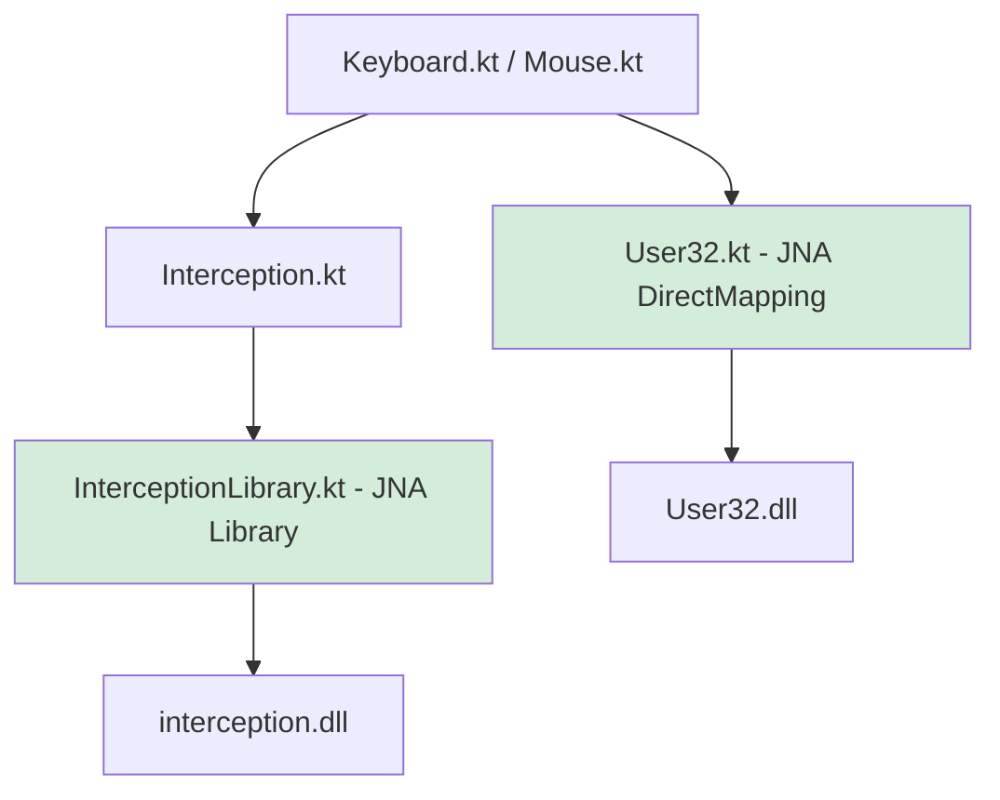

## 用户需求

用户在多次调试后遇到了一系列 Panama FFI API 相关错误，对频繁出错感到不耐烦，要求对项目进行**彻底重构**，从根本上消除问题根源。

## 产品概述

对 Overwatcheat 项目的原生库绑定层进行重构，将不稳定的 Java Panama FFI（`java.lang.foreign.*`）全部替换为项目已有的 JNA 体系，同时修复构建脚本中目录占用导致 build 失败的问题。

## 核心功能

- **用 JNA 替换 Panama FFI**：`Interception.kt`、`User32Panama.kt`、`Keyboard.kt`、`Mouse.kt` 全部改为 JNA 风格，彻底消除 `MemorySession`/`Arena`/`paddingLayout` 等版本敏感 API
- **新建 `InterceptionLibrary.kt`**：用 JNA `Library` 接口声明 interception.dll 的函数签名，利用已有的 `InterceptionStroke` JNA Structure 作为参数类型
- **重写 `User32Panama.kt`**：改用 JNA platform 库（项目已依赖）中已有的 `GetKeyState` 和 `MapVirtualKeyA`，删除所有 Panama 代码
- **修复构建任务**：`build.gradle.kts` 中 `overwatcheat` task 改为容错模式，目录被占用时只覆盖 jar 文件而不强制删除整个目录，避免 `run.bat` 运行时无法重新构建的问题

## 技术栈

- **语言**：Kotlin（保持现有项目约定）
- **原生绑定**：JNA（`com.sun.jna` + `jna-platform`，项目已依赖，版本 5.12.1）
- **构建**：Gradle 8.5 + Kotlin DSL（保持不变）

## 实现思路

### Panama → JNA 替换策略

项目已有完整的 JNA 基础设施（`NativeLib`、`DirectNativeLib`、`InterceptionStroke` JNA Structure），只是 Panama 层与之并行存在。重构思路是**删除 Panama 层，全部走 JNA**：

1. **interception.dll 绑定**：新建 `InterceptionLibrary`（`JNA Library` 接口），声明 `interception_create_context()` 和 `interception_send()`，参数类型直接用已有的 `InterceptionStroke`（JNA Structure），彻底不需要 `MemorySegment`
2. **User32 绑定**：`jna-platform` 已内置 `com.sun.jna.platform.win32.User32`，其中已有 `GetKeyState` 和 `MapVirtualKeyA`。直接调用，删除 `User32Panama.kt` 中的全部 Panama 代码（或直接删除该文件，在调用处换为 platform 包的引用）
3. **Keyboard/Mouse stroke 内存**：原来用 `MemorySegment` 手工操作，改为直接操作 `InterceptionStroke` JNA Structure 的字段，代码更清晰且无版本兼容问题

### 构建任务修复

`build.gradle.kts` 中 `overwatcheat` task 的 `deleteRecursivelyOrThrow()` 改为 `deleteRecursively()`（软删除，失败不抛出），并在删除失败时降级为只覆盖 jar 文件，保证 `run.bat` 运行期间仍可重新构建。

### 性能与兼容性

- JNA DirectMapping 性能接近 JNI，对于鼠标移动的调用频率（每帧一次，约 60fps）完全够用
- JNA Structure 处理对齐完全自动，彻底消除手工 paddingLayout 的问题
- 不引入任何新依赖，不改动业务逻辑层

## 架构设计



## 目录结构

```
src/main/kotlin/org/jire/overwatcheat/
├── Keyboard.kt                                    # [MODIFY] 用 InterceptionStroke 替换 MemorySegment，GetKeyState 改用 JNA User32
├── Mouse.kt                                       # [MODIFY] 用 InterceptionStroke 替换 MemorySegment
├── nativelib/
│   ├── User32Panama.kt                            # [DELETE 或 MODIFY] 删除所有 Panama 代码，改为委托 JNA platform User32
│   ├── User32.kt                                  # [MODIFY] 补充 GetKeyState/MapVirtualKeyA 声明（如尚未有）
│   └── interception/
│       ├── Interception.kt                        # [MODIFY] 改为通过 InterceptionLibrary 加载，删除所有 Panama 代码
│       ├── InterceptionLibrary.kt                 # [NEW] JNA Library 接口，声明 interception_create_context / interception_send
│       └── InterceptionStroke.kt                  # [不变] 已有 JNA Structure，直接复用
build.gradle.kts                                   # [MODIFY] overwatcheat task 改为容错删除逻辑
```

## 关键代码结构

```
// InterceptionLibrary.kt（新建）
interface InterceptionLibrary : Library {
    companion object {
        val INSTANCE: InterceptionLibrary =
            Native.load("interception", InterceptionLibrary::class.java)
    }
    fun interception_create_context(): Pointer
    fun interception_send(context: Pointer, device: Int,
                          stroke: InterceptionStroke, nStroke: Int): Int
}
```

```
// Interception.kt 重构后核心
object Interception {
    val context: Pointer = InterceptionLibrary.INSTANCE.interception_create_context()

    fun send(context: Pointer, device: Int, stroke: InterceptionStroke) =
        InterceptionLibrary.INSTANCE.interception_send(context, device, stroke, 1)
}
```

```
// Keyboard.kt 重构后核心（示意）
object Keyboard {
    private val stroke = InterceptionStroke()

    fun pressKey(key: Int, deviceId: Int) {
        stroke.code = key.toShort()
        stroke.state = InterceptionKeyState.INTERCEPTION_KEY_DOWN.toShort()
        Interception.send(Interception.context, deviceId, stroke)
    }
}
```